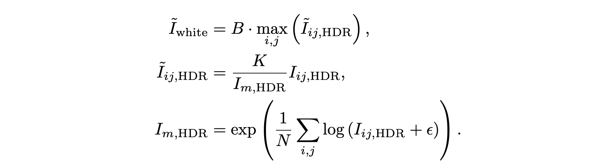

# HDR_Imaging

## Description

This repository presents generating HDR image from stack of images with multiple various exposure setting. Examples are shown below:

This set of pictures are taken inside a kitchen, there are dark regions where shows the indoor kitchen and bright regions where shows outdoor sunlight.

| 1/4096                          | 1/2048                          | 1/1024                          | 1/512                           |
| ------------------------------- | ------------------------------- | ------------------------------- | ------------------------------- |
|  |  |  |  |
| 1/256                           | 1/128                           | 1/64                            | 1/32                            |
|  |  |  |  |

Merged Results:


## Getting Started

### 1. Prepare Images Stack

To get valid HDR image from a set of images stack, we need to acquire camera device that can manually control exposure time, like a DSLR camera or mobile device with professional control app, here we prepare an example of preparing an images stack with Nikon camera with `gphoto2`, a command-line tool to capture images controlled by a laptop.

```bash
gphoto2 --auto-detect
gphoto2 --set-config-value /main/capturesettings/shutterspeed=1/2048
gphoto2 --capture-image-and-download --filename exposure1.%C
```

Afterwards, we need to develop RAW images taken by Nikon camera (with .nef suffix) into TIFF 16 bit format that is more universally used by image processing pipeline.

```bash
dcraw -q 3 -T -4 -f -w -o 1 <input image name>.NEF
```

Where each flags represents:

```bash
-q 3 : Use Adaptive Homogeneity-Directed (AHD) interpolation.
-T   : Write TIFF with metadata instead of PDM/PPM/PAM.
-4   : Linear 16-bit.
-f   : Interpolate RGB as four colors.
-w   : Use the white balance specified by the camera.
-o 1 : sRGB D65 (default) color space.
```

Till this point, you should have both developed `.tiff` files and rendered `.jpg` files in your picture directory.

### 2. Merge Images Stack

To merge images, we can use both RAW images or rendered JPG images. To merge RAW images to get HDR image, optionally, you can set these flags:

```bash
python HDR_MERGE_RAW.py
   --scene <path-to-RAW-dir> 
   --weight_type <"uniform", "tent", "gaussian", "photon", "optimal">
   --downsample <downsampling rate>
   --z_min <Z min to clip>
   --z_max <Z max to clip>
   --merge_mode <"linear" or "log">
```

Unlike RAW images which are linear in intrinsic, JPG images are non-linear and additionally needed to be linearized.

```bash
python HDR_MERGE_JPG.py 
      --scene <path-to-JPG-dir> 
      --weight_type <"uniform", "tent", "gaussian", "photon", "optimal">
      --downsample <downsampling rate>
      --z_min <Z min to clip>
      --z_max <Z max to clip>
      --merge_mode <"linear" or "log">
```

Till this point, you should have a `.hdr` file that has merged results from your images stack. To view HDR file, you **cannot** do it with a standard image viewer, as HDR images may have different exposure scale and till this point it hasn't gone through tone mapping and gamma encoding procedures. However, you can view the intermediate results with some dedicated HDR viewers such as [OpenHDR](https://viewer.openhdr.org/), as it will give you ability to control exposure and various other settings.

### 3. Color Correction and White balancing

In case you have a color checker in your scene, you can perform this step by running:

```bash
python color_correction.py --path_to_hdr <path to your merged hdr file>
```

and white balancing your HDR image:

```bash
python white_balance.py --path_to_hdr <path to your merged hdr file>
```

### 4. Tone Mapping

To apply photographic tone mapping, we follow the method introduced by Reinhard et al.


Where



```bash
python tone_mapping.py --path_to_hdr <path to your merged hdr file>
```

After this step, you should be able to get a rendered HDR image in standard `.png` format, enjoy!