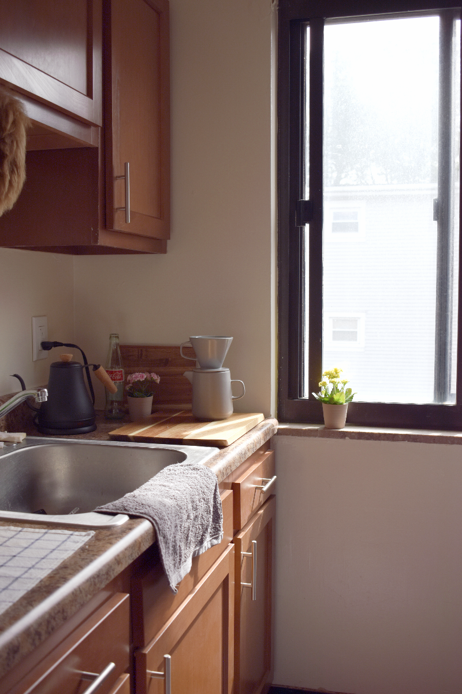

# HDR_Imaging

## Description

This repository presents generating HDR image from stack of images with multiple various exposure setting. Examples are shown below:

This set of pictures are taken inside a kitchen, there are dark regions where shows the indoor kitchen and bright regions where shows outdoor sunlight.

| Exposure time | 1/4096                          | 1/2048                          | 1/1024                          | 1/512                           | 1/256                           | 1/128                           | 1/64                            | 1/32                            |
| ------------- | ------------------------------- | ------------------------------- | ------------------------------- | ------------------------------- | ------------------------------- | ------------------------------- | ------------------------------- | ------------------------------- |
| Pictures      |  |  |  |  |  |  |  |  |

Merged Results:

## Getting Started

